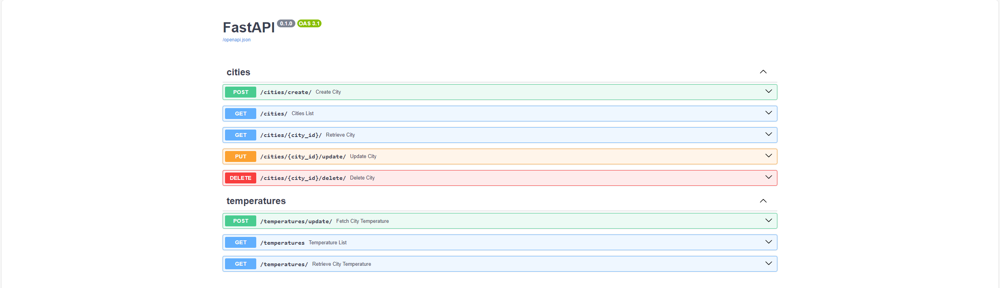

# City Temperature Management API
## Prepare the project using Github + IDE terminal

```bash
git clone https://github.com/mwellick/py-fastapi-city-temperature-management-api.git
cd py-fastapi-city-temperature-management-api
python -m venv venv
source venv/bin/activate  # (on Windows)
source venv/bin/activate # (on macOS/Linux)
git checkout -b develop
pip install -r requirements.txt
```


## Setup the Database:
Before running the following commands, make sure that your SQLite database is properly set up in your environment. 

```bash
alembic revision --autogenerate -m "initial commit" # Run this only on the first setup or after changes to models
alembic upgrade head # Apply the migrations to the database
```

## Run the application
```bash
uvicorn main:app --reload
```

The application will be available at http://127.0.0.1:8000.

### Access the API Documentation:

Swagger UI: http://127.0.0.1:8000/docs


### Endpoints

